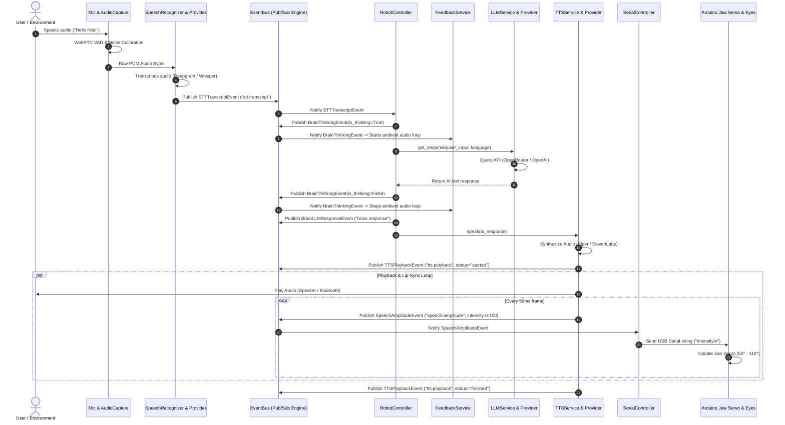

# 🏗️ NILA-V2 Humanoid AI Robot — Complete Architecture Overview

Welcome to the **NILA V2** software architecture documentation. This document provides a complete, developer-friendly explanation of how NILA's software brain works, how data flows through the system, and how to independently develop or extend any part of the codebase.

---

## 📋 Table of Contents
1. [System Overview](#-system-overview)
2. [Event-Driven Architecture & Sequence Diagram](#-event-driven-architecture--sequence-diagram)
3. [Core Architectural Layers](#-core-architectural-layers)
4. [Step-by-Step Execution & Conversation Flow](#-step-by-step-execution--conversation-flow)
5. [Complete Repository File Map](#-complete-repository-file-map)
6. [Developer Onboarding: How to Work on Specific Components](#-developer-onboarding-how-to-work-on-specific-components)
   - [How to Add a New STT Provider](#1-how-to-add-a-new-stt-provider)
   - [How to Add a New TTS Provider](#2-how-to-add-a-new-tts-provider)
   - [How to Add a New LLM / AI Brain Provider](#3-how-to-add-a-new-llm--ai-brain-provider)
   - [How to Subscribe to the EventBus for New Capabilities](#4-how-to-subscribe-to-the-eventbus-for-new-capabilities)
   - [How to Extend Arduino Hardware Control](#5-how-to-extend-arduino-hardware-control)
7. [Configuration System (`.env`)](#-configuration-system-env)
8. [Testing & Verification Suite](#-testing--verification-suite)

---

## 🎯 System Overview

**NILA-V2** is a production-oriented humanoid/interactive AI robot developed by **Robuverse**. While physical hardware (servos, motors, power systems) is managed via Arduino microcontrollers, this repository implements **NILA's AI Brain & Software Architecture**:

- 🎙️ **Speech-to-Text (STT)**: Multi-provider engine supporting **Deepgram (Cloud Nova-2)**, **Faster-Whisper (Local INT8 ONNX)**, and **Google Speech API** with automatic language detection.
- 🧠 **AI Reasoning (LLM)**: Provider gateway supporting **OpenRouter (Gemini 2.5 Flash, Llama 3.1)**, **OpenAI (GPT-4o, GPT-3.5)**, and extensible custom LLM drivers.
- 🔊 **Text-to-Speech (TTS)**: Multilingual synthesis supporting **Piper Neural TTS (Local ONNX)**, **ElevenLabs (Ultra-realistic voice)**, **Google Cloud TTS**, and **gTTS**.
- 👄 **Real-Time Hardware Lip-Sync**: Real-time WAV amplitude analysis (RMS) driving jaw movement via USB Serial to Arduino at 50ms intervals.
- ⚡ **Asynchronous Event Bus**: Decoupled Pub/Sub event architecture (`src/core/event_bus.py`) isolating STT, LLM, TTS, audio SFX, and hardware workers.
- 🌐 **Multilingual Interaction**: Bilingual Malayalam (Native Unicode) + English code-switching and accent handling.

---

## 🏛️ Event-Driven Architecture & Sequence Diagram

NILA V2 uses an in-process **Asynchronous Event Bus** (`EventBus`). Rather than making blocking procedural calls, components emit strongly-typed `Event` objects (`src/core/events.py`) to topics. Other components subscribe to those topics independently.



---

## 🔧 Core Architectural Layers

```text
NILA-V2
│
├── 1. Application Layer (`main.py`, `src/core/robot_controller.py`)
│      Orchestrates lifecycle, signal handling (Ctrl+C), uptime, and session metrics.
│
├── 2. Event Bus Engine (`src/core/event_bus.py`, `src/core/events.py`)
│      Async Pub/Sub message broker supporting wildcard topic matching (e.g. "stt.*", "*")
│      and error isolation across thread boundaries.
│
├── 3. Speech Recognition Engine (`src/services/speech/`)
│      `AudioCapture`: PipeWire parecord/arecord process + WebRTC VAD.
│      `SpeechRecognizer`: Factory instantiating Deepgram, Faster-Whisper, or Google STT.
│
├── 4. AI Brain Layer (`src/services/llm/`)
│      `LLMService`: Factory instantiating OpenRouter, OpenAI, or custom LLM drivers.
│      Maintains short-term memory history and Kerala personality prompt.
│
├── 5. Voice & Synthesis Engine (`src/services/tts/`)
│      `TTSService`: Factory instantiating Piper ONNX, ElevenLabs, Google Cloud, or gTTS.
│      `AudioPlayer`: RMS amplitude analysis triggering real-time lip-sync events.
│
├── 6. Hardware Control Layer (`src/services/hardware/serial_controller.py`)
│      Singleton PySerial driver maintaining USB Serial link (`/dev/ttyUSB0` @ 115200) to Arduino.
│
└── 7. Arduino Firmware Layer (`arduino/robot_head/`)
       `robot_head.ino`: Arduino sketch mapping 0–100 intensity to jaw servo angles (50°–110°).
```

---

## 🔄 Step-by-Step Execution & Conversation Flow

### Step 1: Bootstrap (`main.py`)
1. `main.py` configures logging via `setup_logger()`.
2. Loads configuration settings from `.env` via `Settings()`.
3. Instantiates `RobotController(settings)` and invokes `asyncio.run(robot.start())`.

### Step 2: Listening & VAD (`src/services/speech/audio_capture.py`)
1. `AudioCapture` spawns a Linux subprocess (`parecord` or `arecord`) capturing 16kHz 16-bit mono PCM.
2. Calibrates ambient background noise over the initial 450ms (`15 chunks`).
3. Evaluates frame energy against a dynamic threshold and filters speech using `webrtcvad.Vad(2)`.
4. Stops recording upon detecting 1.5 seconds of trailing silence.

### Step 3: Transcription (`src/services/speech/speech_recognizer.py`)
1. The PCM buffer is sent to the active STT provider:
   - **Deepgram**: Wrapped in a WAV container and POSTed to Deepgram's `nova-2` endpoint.
   - **Whisper**: Converted to float32 numpy array and processed locally via `faster_whisper.WhisperModel`.
   - **Google**: Converted to `sr.AudioData` and sent to Google's speech recognition endpoint.
2. An `STTTranscriptEvent` is published to topic `"stt.transcript"`.

### Step 4: AI Reasoning & Thinking SFX (`src/services/llm/llm_service.py`)
1. `RobotController` receives the text and publishes `BrainThinkingEvent(is_thinking=True)` to `"brain.thinking"`.
2. `FeedbackService` receives `BrainThinkingEvent` and starts a background audio loop playing thinking sounds from `data/audio/sfx/thinking/`.
3. `LLMService` formats system instructions (Kerala persona, 1–2 sentence max, no emojis, native Malayalam Unicode support), appends conversation history, and calls the active LLM provider (OpenRouter / OpenAI).
4. Upon completion, `RobotController` publishes `BrainThinkingEvent(is_thinking=False)` (stopping feedback audio) and `BrainLLMResponseEvent` to `"brain.response"`.

### Step 5: Synthesis & Lip-Sync (`src/services/tts/piper_provider.py`)
1. `TTSService.speak(ai_response)` sends text to the active TTS provider.
2. If **Piper**:
   - Checks audio cache in `data/audio/piper/`.
   - If uncached, executes `tools/piper/piper` binary with ONNX model `data/models/piper/ml_IN-arjun-medium.onnx`.
   - Plays audio using system player (`pw-play` / `paplay` / `aplay`).
   - Simultaneously reads WAV frames via Python `wave` + `audioop.rms`, calculates 0–100 amplitude intensity every 50ms, and publishes `SpeechAmplitudeEvent` to `"speech.amplitude"`.
3. `SerialController` receives `SpeechAmplitudeEvent` and sends ASCII command `"intensity\n"` to `/dev/ttyUSB0`.
4. Arduino receives the command, maps `0-100` to servo angle `50°-110°`, and updates the robot's jaw servo.

---

## 📁 Complete Repository File Map

```text
NILA-V2/
├── .env                              # Active environment variables (API keys, ports, models)
├── .env.template                     # Template for environment configuration
├── ARCHITECTURE_OVERVIEW.md          # [THIS FILE] System architecture documentation
├── DEEPGRAM_SETUP.md                 # Setup guide for Deepgram STT
├── LLM_INTEGRATION_SUMMARY.md        # Summary of LLM provider integration
├── LLM_SETUP_GUIDE.md                # Guide for OpenRouter & OpenAI configuration
├── PI_AUDIO_FIX.md                   # PipeWire / ALSA audio troubleshooting guide
├── RASPBERRY_PI_AUDIO_SETUP.md       # Audio configuration guide for Raspberry Pi 4/5
├── README.md                         # Quickstart repository overview
├── TTS_VOICE_GUIDE.md                # Voice tuning guide for Piper, Google Cloud, ElevenLabs
├── main.py                           # Main application entry point
├── realtime_robot.py                 # Standalone experimental script for OpenAI Realtime WebSocket API
├── requirements.txt                  # Python dependencies
├── setup.sh                          # Automated installation bash script
│
├── arduino/                          # Microcontroller Firmware
│   └── robot_head/
│       ├── robot_head.ino            # Production Arduino sketch: 1 Jaw Servo (Pin 7) + Eye LED (Pin A1)
│       └── robot.ino                 # Experimental sketch: 8 Servo body motion state machine
│
├── data/                             # Runtime Assets & Storage
│   ├── audio/                        # Cached generated speech audio files
│   │   ├── elevenlabs/               # ElevenLabs TTS cache (.mp3)
│   │   ├── gtts/                     # gTTS cache (.mp3)
│   │   ├── piper/                    # Piper TTS cache (.wav)
│   │   └── sfx/thinking/             # Ambient audio clips played during LLM thinking phase
│   ├── logs/
│   │   └── robot.log                 # System log file
│   └── models/
│       ├── piper/                    # Piper ONNX neural voice models (ml_IN-arjun, ml_IN-meera, etc.)
│       └── vosk/                     # Offline Vosk STT model
│
├── extra/                            # External Auxiliary Microservices
│   └── tts_server/                   # Standalone FastAPI server for Indic-Parler-TTS
│       ├── requirements.txt
│       ├── run.sh
│       └── server.py
│
├── scripts/                          # Diagnostic & Setup Scripts
│   ├── find_arduino.py               # Scans USB serial ports for connected Arduino
│   ├── fix_pi_audio.sh               # Restarts PipeWire audio daemons on Linux/Pi
│   ├── list_audio_devices.py         # Lists ALSA/PipeWire audio input & output nodes
│   ├── setup_pi.sh                   # Installs Linux OS dependencies
│   ├── setup_piper.py                # Downloads Piper executable binary & ONNX voice models
│   ├── test_audio_capture.py         # Diagnostic script testing microphone capture & VAD
│   ├── test_decoupled.py             # Integration test verifying decoupled TTS pipeline
│   ├── test_hardware.py              # Interactive script testing Arduino jaw movements
│   └── test_vad.py                   # Diagnostic script testing WebRTC VAD
│
├── src/                              # Core Source Code
│   ├── config/
│   │   └── settings.py               # Centralized configuration class (Pydantic BaseSettings)
│   ├── core/
│   │   ├── event_bus.py              # Asynchronous Pub/Sub EventBus engine
│   │   ├── events.py                 # Strongly-typed system Event data classes
│   │   └── robot_controller.py       # Main orchestrator & lifecycle manager
│   ├── services/
│   │   ├── base_worker.py            # Base worker class for event subscribers
│   │   ├── audio/
│   │   │   └── audio_player.py       # Pygame audio player with RMS amplitude analysis
│   │   ├── feedback/
│   │   │   └── feedback_service.py   # Manages ambient thinking audio SFX loop
│   │   ├── hardware/
│   │   │   └── serial_controller.py  # PySerial singleton communicating with Arduino
│   │   ├── llm/
│   │   │   ├── base_provider.py      # Abstract base class for LLM drivers & memory history
│   │   │   ├── llm_service.py        # LLM Factory (OpenAI, OpenRouter, Anthropic)
│   │   │   ├── openai_provider.py    # Driver for OpenAI API
│   │   │   ├── openrouter_provider.py# Driver for OpenRouter API
│   │   │   └── anthropic_provider.py # Stub driver for Anthropic Claude
│   │   ├── speech/
│   │   │   ├── audio_capture.py      # Subprocess audio recorder using parecord/arecord + VAD
│   │   │   ├── base_stt_provider.py  # Protocol interface & STTResult data class
│   │   │   ├── speech_recognizer.py  # High-level STT manager
│   │   │   └── providers/
│   │   │       ├── deepgram_stt_provider.py # Driver for Deepgram Nova-2 API
│   │   │       ├── google_stt_provider.py   # Driver for Google Free STT
│   │   │       └── whisper_stt_provider.py  # Driver for Faster-Whisper local INT8
│   │   └── tts/
│   │       ├── base_tts_provider.py         # Abstract base class for TTS drivers
│   │       ├── tts_service.py               # TTS Factory
│   │       ├── piper_provider.py            # Driver for local Piper TTS + Jaw lip-sync
│   │       ├── elevenlabs_tts_provider.py   # Driver for ElevenLabs API
│   │       ├── google_cloud_tts_provider.py # Driver for Google Cloud TTS API
│   │       ├── gtts_provider.py             # Driver for gTTS free API
│   │       └── ai4bharat_provider.py        # Driver for remote Indic-Parler-TTS server
│   └── utils/
│       ├── alsa_error_handler.py     # Ctypes context manager suppressing C-level ALSA errors
│       └── logger.py                 # Logging setup with UTF-8 support
│
├── tests/                            # Automated Unit & Integration Tests
│   ├── manual_stt_check.py           # Quick manual test for STT audio capture
│   ├── test_event_bus.py             # Unit test suite for EventBus Pub/Sub engine
│   └── test_openrouter.py            # Integration test for OpenRouter LLM service
└── tools/                            # Compiled Third-Party Binaries
    └── piper/                        # Local Piper TTS binary & espeak-ng data
```

---

## 🛠️ Developer Onboarding: How to Work on Specific Components

To work independently on a specific feature without breaking the rest of NILA, follow these guidebooks:

### 1. How to Add a New STT Provider
1. Create a new file in `src/services/speech/providers/` (e.g. `my_custom_stt_provider.py`).
2. Inherit from `BaseSTTProvider` (`src/services/speech/base_stt_provider.py`) and implement `async def transcribe(self, audio_bytes: bytes, language: Optional[str] = None) -> STTResult`.
3. In `src/services/speech/speech_recognizer.py`, update `_init_provider()` to check `self.settings.SPEECH_PROVIDER == "my_custom"` and instantiate your provider.
4. Add any required settings to `src/config/settings.py` and `.env.template`.

### 2. How to Add a New TTS Provider
1. Create a new file in `src/services/tts/` (e.g. `azure_tts_provider.py`).
2. Inherit from `BaseTTSProvider` (`src/services/tts/base_tts_provider.py`) and implement `async def speak(self, text: str, language: Optional[str] = None) -> bool`, `stop_speaking()`, `cleanup()`, and `get_provider_name()`.
3. In `src/services/tts/tts_service.py`, update `_initialize_provider()` to instantiate your new provider when `TTS_PROVIDER == "azure"`.
4. To enable jaw lip-sync with your provider, emit `SpeechAmplitudeEvent(intensity=val)` to topic `"speech.amplitude"` during audio playback.

### 3. How to Add a New LLM / AI Brain Provider
1. Create a new file in `src/services/llm/` (e.g. `gemini_provider.py`).
2. Inherit from `BaseLLMProvider` (`src/services/llm/base_provider.py`) and implement `async def get_response(self, user_message: str, language: Optional[str] = None) -> Optional[str]`.
3. Call `self.add_to_history("user", user_message)` and `self.add_to_history("assistant", response)` to preserve conversation memory.
4. In `src/services/llm/llm_service.py`, update `_create_provider()` to return your provider when `LLM_PROVIDER == "gemini"`.

### 4. How to Subscribe to the EventBus for New Capabilities
If you want to add a new capability (e.g., Wake Word detection, Vision camera triggers, or Email Workflows):
1. Import `EventBus` and `Event` in your service:
   ```python
   from src.core.event_bus import EventBus
   from src.core.events import Event

   bus = EventBus()
   ```
2. Subscribe to existing topics (e.g., `"stt.transcript"`, `"brain.response"`, `"system.state"`, or wildcards like `"stt.*"`):
   ```python
   def my_custom_handler(event: Event):
       print(f"Received event on topic {event.topic}: {event.payload}")

   bus.subscribe("stt.transcript", my_custom_handler)
   ```
3. To publish custom events from your service:
   ```python
   await bus.publish(Event(topic="my_feature.custom_event", payload={"data": 123}))
   ```

### 5. How to Extend Arduino Hardware Control
1. To add new motor or servo commands (e.g. arm waves, head tilts):
   - Update `arduino/robot_head/robot_head.ino` to parse new command strings from Serial (e.g., `"ARM_WAVE\n"` or `"INTENSITY,ANGLE\n"`).
2. In `src/core/events.py`, add a new event class (e.g. `HardwareGestureCommandEvent`).
3. In `src/services/hardware/serial_controller.py`, subscribe to `"hardware.gesture"` and write the corresponding ASCII string to `self.serial_conn.write()`.

---

## ⚙️ Configuration System (`.env`)

NILA V2 uses Pydantic Settings (`src/config/settings.py`) to parse environment variables from `.env`.

Key parameters in `.env`:

```env
# ENVIRONMENT
ENVIRONMENT=development
DEBUG=True

# PROVIDERS SELECTION
LLM_PROVIDER=openrouter           # openrouter | openai | anthropic
SPEECH_PROVIDER=deepgram          # deepgram | whisper | google
TTS_PROVIDER=piper                # piper | elevenlabs | google_cloud | gtts

# API KEYS
OPENROUTER_API_KEY=your_key_here
OPENROUTER_MODEL=google/gemini-2.5-flash
DEEPGRAM_API_KEY=your_key_here
ELEVENLABS_API_KEY=your_key_here
ELEVENLABS_VOICE_ID=j36Me84eUGSrrHkIwAZQ

# HARDWARE SERIAL
SERIAL_PORT=/dev/ttyUSB0
SERIAL_BAUD=115200
```

---

## 🧪 Testing & Verification Suite

Run automated unit and integration tests to verify system health:

```bash
# Activate virtual environment
source venv/bin/activate

# 1. Run EventBus Unit Tests
python3 -m unittest tests/test_event_bus.py

# 2. Run Decoupled TTS Pipeline Test
python3 scripts/test_decoupled.py

# 3. Test USB Serial Arduino Hardware Connection
python3 scripts/test_hardware.py --port /dev/ttyUSB0

# 4. Scan for connected Arduino USB ports
python3 scripts/find_arduino.py

# 5. Run OpenRouter Integration Test
python3 tests/test_openrouter.py
```

---

*Last Updated: August 2026*  
*Architecture Version: 2.0 (Event-Driven Architecture)*
